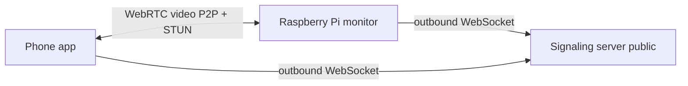

# Remote viewing over the internet (WebRTC)

Watch the baby monitor from anywhere **without opening ports** on each home router.

## How it works



1. **Signaling server** (small WebSocket relay) runs on a public VPS/cloud.
2. **Pi** connects **outbound** to the server (no router port forward).
3. **Phone** connects outbound too and exchanges WebRTC offer/answer via the server.
4. **Video** flows peer-to-peer when possible (Google STUN). Strict NATs may need TURN later.

**Local Wi-Fi mode** is unchanged: MJPEG at `http://PI_IP:5001/video_feed`.

## 1. Deploy signaling server (once)

On a VPS / cloud instance with a public IP:

```bash
pip install websockets
python signaling_server.py --host 0.0.0.0 --port 8765
```

Use **wss://** in production (nginx/Caddy TLS proxy in front of port 8765).

Example URL: `wss://your-domain.com/signaling`

## 2. Configure the Raspberry Pi

```bash
pip install -r requirements-remote.txt

export BABYMONITOR_SIGNALING_URL=wss://your-domain.com/signaling
python3 web_server.py
```

Or edit `device_config.json` after first run:

```json
{
  "device_id": "...",
  "access_token": "...",
  "signaling_url": "wss://your-domain.com/signaling"
}
```

The Pi registers as **monitor** using `device_id` + `access_token`.

## 3. Pair the phone (Bluetooth — same as Wi-Fi setup)

1. Open **Connect monitor** in the app.
2. Connect over BLE, set Wi-Fi if needed.
3. The app reads **remote credentials** automatically and saves:
   - `device_id`
   - `access_token`
   - `signaling_url`

No keyboard on the Pi is required.

## 4. Watch from anywhere

On the home screen choose **Internet** (instead of **Local Wi-Fi**).

The app connects to the signaling server and starts a WebRTC session with your monitor.

## Security notes

- Each monitor has a random **access_token** ( exchanged once over BLE ).
- The signaling server rejects viewers with the wrong token.
- For production, always use **wss://** and keep the token secret.

## Troubleshooting

- **Internet option disabled**: complete BLE pairing once so remote credentials are saved.
- **Connecting forever**: check Pi has internet, signaling URL is correct, server is running.
- **Black remote video**: install `requirements-remote.txt` on Pi; check logs for `aiortc` errors.
- **Works on LTE but not on some Wi-Fi**: strict NAT — add a TURN server (future enhancement).
