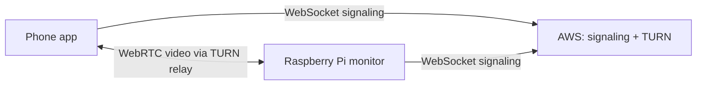

# Remote viewing over the internet (WebRTC)

Watch the baby monitor from anywhere **without opening ports** on the home router.

## How it works



1. **Signaling server** (WebSocket relay) runs on a public VPS/cloud.
2. **TURN server** (coturn) on the same cloud relays video when phone and Pi are on different networks.
3. **Pi** and **phone** connect **outbound** to signaling (no router port forward at home).
4. **Same Wi-Fi often works without TURN** (local network paths). **Mobile data / other Wi-Fi needs TURN.**

**Local Wi-Fi mode** is unchanged: MJPEG at `http://PI_IP:5001/video_feed`.

## 1. Deploy on AWS (signaling + TURN)

### 1a. Signaling server

```bash
sudo apt update
sudo apt install python3-pip
sudo apt install python3-websockets
pip install websockets
python signaling_server.py --host 0.0.0.0 --port 8765
```

**Security group inbound:** TCP `8765` (signaling)

Example URL: `ws://YOUR_AWS_PUBLIC_IP:8765`

If port 8765 is already in use, stop the old process first:

```bash
sudo ss -tlnp | grep 8765
# kill the PID shown, or: sudo fuser -k 8765/tcp
python3 signaling_server.py --host 0.0.0.0 --port 8765
```

Run signaling under `systemd` or `screen` so it survives logout.

### 1b. TURN server (required for mobile data / remote Wi-Fi)

```bash
sudo apt update
sudo apt install coturn
sudo cp turnserver.conf.example /etc/turnserver.conf
# Edit: set external-ip, user=username:password
sudo systemctl enable coturn
sudo systemctl start coturn
```

**Security group inbound:**

| Port | Protocol | Purpose |
|------|----------|---------|
| 3478 | TCP + UDP | TURN |
| 49160-49200 | UDP | TURN relay media |

On EC2, set **both** public and private IP in coturn (replace with your values):

```conf
listening-ip=172.31.17.33
external-ip=16.164.26.68/172.31.17.33
```

`ss` may still show `172.31.17.33:3478` — that is normal. Test with:

```bash
turnutils_uclient -v -u babymonitor -w YOUR_PASSWORD 16.164.26.68
```

Use the same username/password in `device_config.json` on the Pi (see below).

## 2. Configure the Raspberry Pi

```bash
pip install -r requirements-remote.txt
```

Edit `device_config.json`:

```json
{
  "device_id": "...",
  "access_token": "...",
  "signaling_url": "ws://YOUR_AWS_PUBLIC_IP:8765",
  "turn_url": "turn:YOUR_AWS_PUBLIC_IP:3478",
  "turn_username": "babymonitor",
  "turn_password": "YOUR_TURN_PASSWORD"
}
```

Or use environment variables before starting:

```bash
export BABYMONITOR_SIGNALING_URL=ws://YOUR_AWS_PUBLIC_IP:8765
export BABYMONITOR_TURN_URL=turn:YOUR_AWS_PUBLIC_IP:3478
export BABYMONITOR_TURN_USERNAME=babymonitor
export BABYMONITOR_TURN_PASSWORD=YOUR_TURN_PASSWORD
python3 web_server.py
```

Restart `web_server.py` after editing config.

## 3. Sync credentials to the phone

On the **same Wi-Fi as the Pi** (once):

1. Open the app — it fetches `http://PI_IP:5001/remote/info`, **or**
2. Open **Connect monitor** → connect → **Use this monitor**

This saves `device_id`, `access_token`, `signaling_url`, and **TURN settings** on the phone.

After that, **Internet mode works from mobile data** (no home Wi-Fi needed).

## 4. Watch from anywhere

On the home screen choose **Internet** (instead of **Local Wi-Fi**).

## Security notes

- Each monitor has a random **access_token** ( exchanged once over BLE / local HTTP ).
- The signaling server rejects viewers with the wrong token.
- Use strong TURN credentials; restrict AWS security group to needed ports only.

## Troubleshooting

- **Works on home Wi-Fi but not on mobile data**: TURN is missing or misconfigured. Check coturn is running and AWS UDP ports are open.
- **AWS log `Client disconnected`**: normal when the phone closes the app or WebRTC fails; not fatal if TURN is set up correctly.
- **Internet option disabled**: sync credentials once on home Wi-Fi (`/remote/info`).
- **Connecting forever**: Pi has internet, signaling URL correct, coturn running.
- **Black remote video**: install `requirements-remote.txt`; check Pi logs for aiortc errors.
